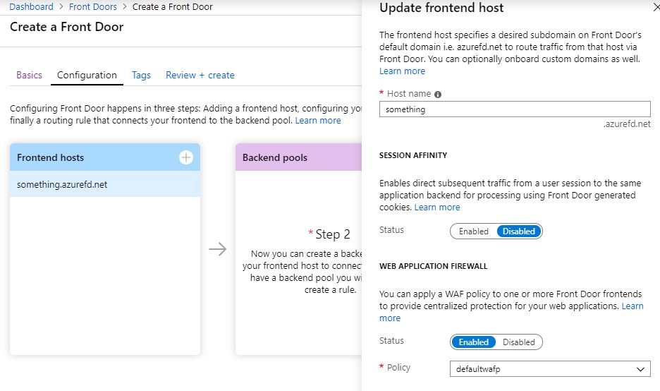
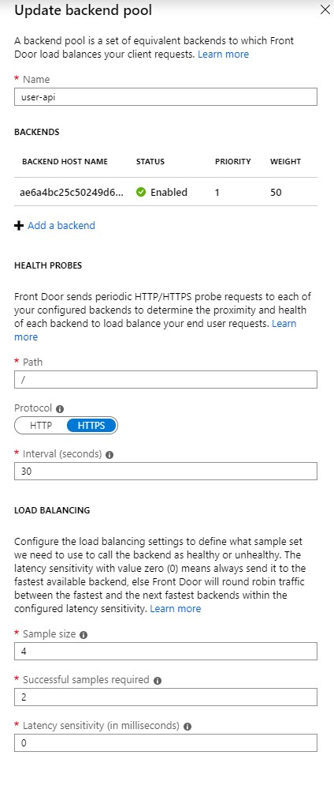
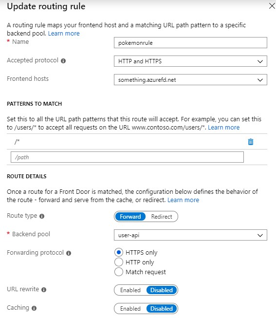
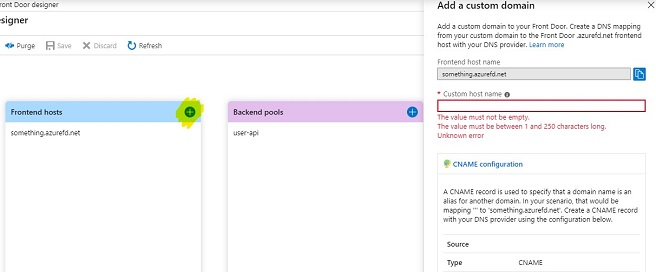

[< back](index)

blogged: 2019.09.25

# Azure Front Door Service

Creating a large application and exposing it to the web has a lot of challenges. You will have to think about performance, security, reliability and there is a fair change that although your company is not Netflix you might have an application that consists out of multiple frontends, cdns and apis. And maybe you want to have your applications on multiple geolocations for performance or availability. 

There are a lot of different solutions targeting a routing puzzle like this but in this blog we will dive into the capabilities of "Azure Front Door Service" (from here FDS because I'm lazy). FDS is a nice name because it is a service that provides an entry point for your web application. It actually provides you multiple entry points, your user will be routed to the nearest 'point of presence' and from there the actual route to your web application will be determined.

## Setting up FDS

If you create your FDS you will have to select a resource group and a region to create it, like any other resource. But the actual service that is hosting the endpoints is running on different pops around the world. The setup of the service consists out of three parts that you will have to configure.

### Frontend hosts

Here you can define your entry points. A frontend host has a host name (something.azurefd.net). You can if you want session affinity here and if you want to add a WAF (Web application firewall) by adding a WAF policy that you have defined.

### Backend pools

You will have to create one or more Backend pools. In these pools you will add 'Backends', these backends are your web applications that you want to expose. I know what you are thinking and yes, from your applications perspective these are frontends. A configuration of a backend pool contains a definition for health probes. To be able to keep the promise of all the cool routing and failover features the pool needs to know if a 'Backend' is up and running. Per backend you can also define 'weight' if you want to give some backends more traffic then others. This might be useful if you are doing A-B testing or if you have canary releases.

### Routing rules

To tie it all together you need at least one routing rule. If the service gets a request on a frontend host it has to match it to a pattern, the simplest catch all **(/*)** is a mandatory rule to have. In these rules you simply bind an incoming url path to one of your backend pools. You can basically to two things, forward or redirect. With these rules you can also define what incoming protocols to accept (http or https) and with what protocol to route to the backend.

## Features

You can add a **Custom Domain** to the service as you would expect. After you have created the front door you need to click the 'plus sign' again in frontend hosts.

A feature that in my opinion should be present in all the Azure services that have a custom domain option is **certificate management**. Next to uploading your own you can have one created and rotated by FDS.

FDS supports end-to-end **IPv6** connectivity and by supporting **HTTP/2** it can reduce a lot of traffic overhead hitting your backends.

With the **caching** option that you can setup per routing rule you control what is cached and you will be able to serve some of your content to the user directly from the pop without hitting any backend.

## Possible Scenarios

- Improving performance by serving from cache at the endpoints
- Improving performance by reducing direct connections
- Exposing multiple apps on different paths of a single domain
- Routing traffic to the nearest host
- Failover plan in other region
- A-B testing or canary releases
- All of the above!

## Good to know
This is a service that you can use for big and complex applications with a global presence, considering this the price isn't too bad. But this might be a bit overkill for your side project.

If you think you need this service be sure to check out the [official docs](https://docs.microsoft.com/en-us/azure/frontdoor/) for all the details.

[oscarvantol.nl](https://oscarvantol.nl) 

